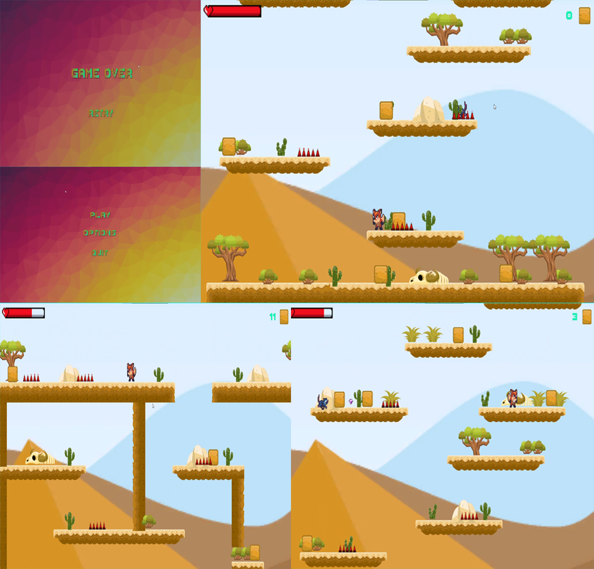

# Sky-Climber-2D
* Sky Climber 2D is a platformer game made with Unity Game Engine. 
* Assets are completely taken from Unity Asset store.
* 2D Top-Down platformer based games are created using scripting. These games are heavily based upon scripting and animations.
* Support of colliders are taken.
* A set of audio files are also added to gain more gamish effect.

# Aim
The main aim behind this game was to implement the basic knowledge of programming which is involved while making a particular game.

# StoryLine 
Toby is a small fox got seperated from his family and the objective is to climb up all the platforms to reach his family
# System Requirements
* Windows 10 pro
* Unity 2018(LTS)
* Visual Studios 17 or above
* Core i5 processors 7th gen or above.
* Dedicated GPU (Nvidia or AMD) Recomended.

# Getting Started
Start by downloading the project from given link at the bottom.
Unity 2018 with (LTS) recomended.

* Visual Studio 2019 or 2019 is recommended, It is made to run on Windows OS (8,10).
* Unity 2018(LTS) is recomended.
* Basics of C# language.
* Knowledge on ray tracing with unity.

# Main features to come:
* A complete game with different set of levels.
* A proper implemented story line.
* Some more audio.
* Complete animation set.
* Redefined physics scripting

# Short term goals :
Note: this is subject to change at any time!

* Create more levels on this project\n.
* Implement animated story line\n.
* Complete rest of the game project\n.

